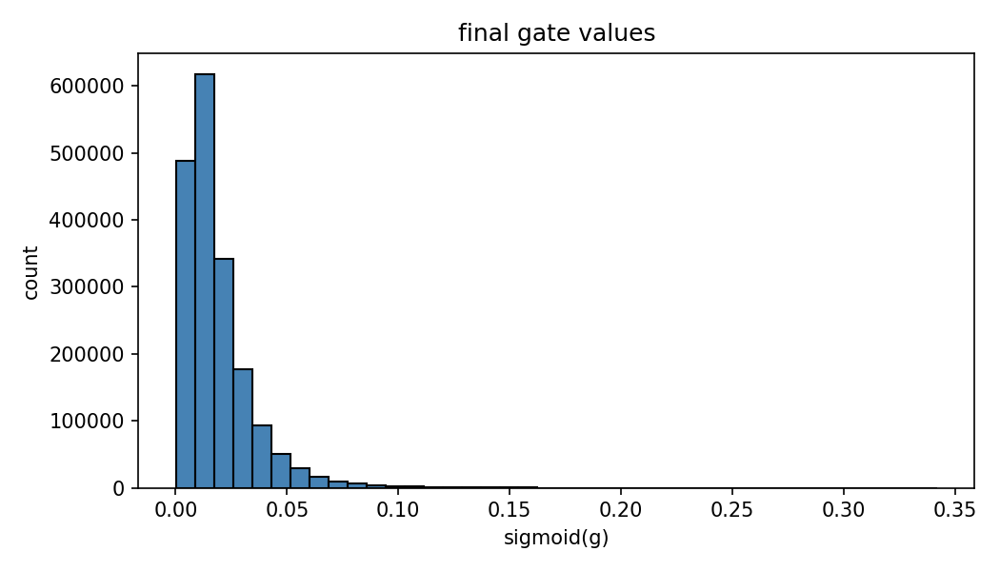

# Self-Pruning Neural Network (MLP)

This project is a PyTorch implementation of a self-pruning MLP on CIFAR-10.
Instead of pruning after training, each weight has a learnable gate trained jointly with the model.

## Project Idea

Each dense layer is a custom gated linear layer:

```text
effective_weight = weight * sigmoid(gate_score)
```

Connections with small gate values become negligible and are effectively pruned during training.

## Model Setup

- Dataset: CIFAR-10
- Architecture: 3-layer MLP
- Activation: ReLU
- Layer type: custom gated linear layer

## Loss Function

```text
Total Loss = CrossEntropy Loss + lambda_reg * Sparsity Loss
```

- `CrossEntropy Loss`: classification objective
- `Sparsity Loss`: sum of gate activations (L1-style pressure toward sparse connectivity)

Sparsity in this project is measured as the percentage of effective weights with magnitude less than `1e-3`.

## Effect of Lambda on Sparsity and Accuracy

To evaluate regularization strength, run the model with different values of `lambda_reg` while keeping all other settings fixed.

### Results

| Lambda | Test Accuracy (%) | Sparsity (%)  |
| ------ | ----------------- | ------------  |
| 0.0001 | 52.12             | 31.1          |
| 0.001  | 46.63             | 33            |
| 0.01   | 45.94             | 35.16         |

> Replace `XX.X` with values from `experiments/run_*.txt` after running the experiments.

### Observations

- As lambda increases, sparsity increases (more effective pruning).
- Lower lambda preserves more connections and generally yields higher accuracy.
- Higher lambda enforces stronger regularization, improving compression but potentially reducing performance.
- This shows a clear trade-off between model accuracy and model sparsity.

### Conclusion

- `lambda_reg = 0.0001`: higher accuracy, lower sparsity
- `lambda_reg = 0.001`: balanced trade-off
- `lambda_reg = 0.01`: higher sparsity, lower accuracy

Choose lambda based on objective:

- Maximum performance: lower lambda
- More compression/efficiency: higher lambda

## Running Experiments

Install dependencies:

```bash
pip install -r requirements.txt
```

Run one experiment manually:

```bash
python train.py --lambda_reg 0.0001
python train.py --lambda_reg 0.001
python train.py --lambda_reg 0.01
```

Or run all three with the helper script:

```bash
python run_experiments.py
```

Each run outputs:

- Final test accuracy
- Sparsity percentage
- Per-run artifacts under `out/lambda_<lambda>/`
- Run summary file under `experiments/run_<lambda>.txt`

## Experiment Logs

After running the lambda sweep, logs are saved in:

```text
experiments/
	run_0.0001.txt
	run_0.001.txt
	run_0.01.txt
```
## 📊 Gate Value Distribution

The histogram below shows the distribution of learned gate values (after applying sigmoid) at the end of training.



### 🔍 Insight

* Most gate values are concentrated near **0**, indicating that many connections are effectively turned off.
* Only a small fraction of gates have higher values, representing important connections.
* This demonstrates that the model **automatically learns sparsity** without explicit pruning steps.

### 🧠 Interpretation

The gating mechanism enables the network to:

* Retain important weights
* Suppress less useful connections
* Achieve model compression during training

This behavior aligns with the objective of a **self-pruning neural network**.


---

## Key Insight

Learnable gating with sparsity regularization enables automatic pruning during training, making the network adaptive and more efficient without a separate pruning stage.

